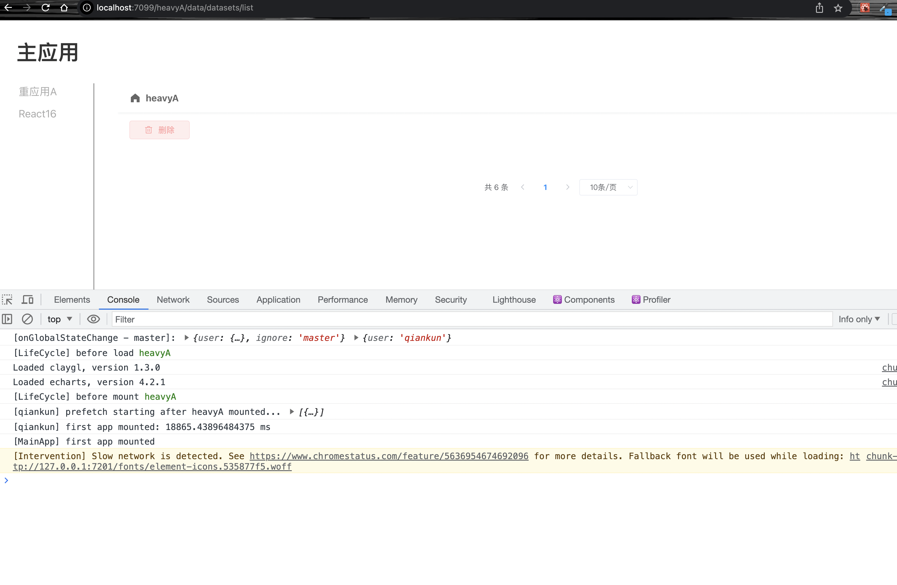

## 复现 https://github.com/umijs/qiankun/issues/2547

- 启动主应用，两个字应用

  - `npm run examples:install`
  - `npm run examples:start`

- 选中微应用 `重应用A`，稍后可以正常加载，如图：

- **关键步骤**
  - 点击浏览器操作栏的 `刷新` 按钮，立即切换到 `React16`
  - 后面会自动跳转到 `重应用A`，但却无法正常渲然了。如图：

